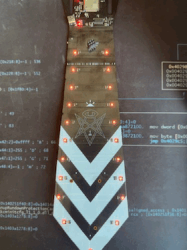

NorthSec 2024 badge
===================

Brought to you by the Team badge of NorthSec.

## Overview

<p align="center">
   <br>
</p>

## Hardware

The NorthSec 2024 badge is loosely based on the ESP32-S3-DevKitC-1 design with an
[ESP32-S3 microcontroller](https://www.espressif.com/en/products/socs/esp32-s3)
(ESP32-S3-WROOM-1-N8R8) which is used to drive several periphery devices:

- Sixteen [NeoPixel](https://en.wikipedia.org/wiki/Adafruit_Industries#NeoPixel) RGB LEDs
- Six buttons
- Two 'pairing' connectors
- Four [Shitty Add-On V1.69bis](https://hackaday.com/2019/03/20/introducing-the-shitty-add-on-v1-69bis-standard/) connector

The badge is powered through a USB-C port or through 3 AAA batteries.

If you wish to hack your badge or create a new one based on the hardware. All
the information [is available here](hw/2024/).

## Building the firmware

The firmware is based on the [Espressif IoT Development
Framework](https://docs.platformio.org/en/latest/frameworks/espidf.html). The
build system uses
[PlatformIO](https://docs.platformio.org/en/stable/what-is-platformio.html) to
easily manage the dependencies.

You can install it on Debian / Ubuntu in a python virtualenv with these
commands:

```bash
sudo apt install python3-virtualenv

virtualenv .venv
. .venv/bin/activate

pip install platformio
```

The installation procedure for your OS may differ a little, please consult the
[PlatformIO
documentation](https://docs.platformio.org/en/stable/core/installation/index.html)
if you have any difficulties.

Once the installation is complete you can build the firmware:

```bash
# Conference firmware
pio run -e conference

# CTF firmware
pio run -e ctf

# Addon firmware
pio run -e addon
```

## Flashing

Flash the firmware with this command:

```bash
# Conference firmware
pio run -t upload -e conference

# CTF firmware
pio run -t upload -e ctf

# Addon firmware
pio run -t upload -e addon
```

if multiple badges are connected, you can select which badge will be flash
with the "--upload-port [port name]" option:

```bash
# Conference firmware
pio run -t upload -e conference --upload-port [port name]
```

## Debugging

To read the logging statements output on the USB serial interface, it is
possible to use `pio device monitor` or `idf.py`'s `monitor` command.

However, you can use your preferred terminal emulator by pointing it to the
`/dev/ttyACM0` device. The badge is configured to output at 115'200 bauds,
without parity, and with one stop bit per character.

Note that electrically resetting the board using the hardware switch will
cause the pseudo-terminal device to disappear, making it hard to read the
logs emitted during boot.

Pulsing the DTR signal (lowering it for 1 second) will cause the board to reset
without affecting the pseudo-terminal device, allowing you to read early-boot
messages. This is supported by most terminal emulators.

## Credits
NorthSec CTF badge 2024 is brought to you by the team work of:

 - [EiNSTeiN-](https://github.com/EiNSTeiN-)
 - [Svieg](https://github.com/Svieg)
 - [jgalar](https://github.com/jgalar)
 - [jmarcil](https://github.com/jmarcil)
 - [lle](https://github.com/lle)
 - [mjeanson](https://github.com/mjeanson)
 - [nyx0](https://github.com/nyx0)
 - [sylemieux](https://github.com/sylemieux)

Special thanks to:
 - [20th](https://github.com/20th)
 - [mtartare](https://github.com/mtartare)
