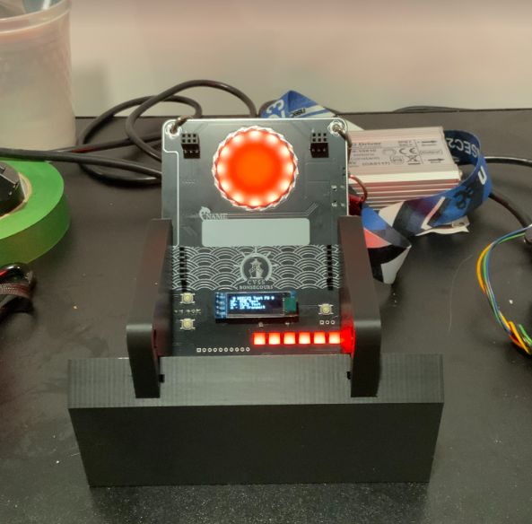

NorthSec 2025 badge
===================

Brought to you by the Team badge of NorthSec.

## Overview

<p align="center">
   <br>
</p>

## Hardware

The NorthSec 2025 badge is loosely based on the ESP32-C3 design with an
[ESP32-C3 microcontroller](https://www.espressif.com/en/products/socs/esp32-c3)
(ESP32-C3-WROOM-02-N4) which is used to drive several periphery devices:

- Eighteen [NeoPixel](https://en.wikipedia.org/wiki/Adafruit_Industries#NeoPixel) RGB LEDs
- Five buttons
- One IR 'pairing' connector
- Two [Shitty Add-On V1.69bis](https://hackaday.com/2019/03/20/introducing-the-shitty-add-on-v1-69bis-standard/) connector

The badge is powered through a USB-C port or through 3 AAA batteries.

If you wish to hack your badge or create a new one based on the hardware. All
the information [is available here](hw/2025/).

## Building the firmware

The firmware is based on the [Espressif IoT Development
Framework](https://docs.platformio.org/en/latest/frameworks/espidf.html). The
build system uses
[PlatformIO](https://docs.platformio.org/en/stable/what-is-platformio.html) to
easily manage the dependencies.

You can install it on Debian / Ubuntu in a python virtualenv with these
commands:

```bash
sudo apt install python3-virtualenv

virtualenv .venv
. .venv/bin/activate

pip install platformio
```

The installation procedure for your OS may differ a little, please consult the
[PlatformIO
documentation](https://docs.platformio.org/en/stable/core/installation/index.html)
if you have any difficulties.

Once the installation is complete you can build the firmware:

```bash
# Conference firmware
pio run -e conference

# CTF firmware
pio run -e ctf
```

## Flashing

Flash the firmware with this command:

```bash
# Conference firmware
pio run -t upload -e conference

# CTF firmware
pio run -t upload -e ctf
```

If multiple badges are connected, you can select which badge will be flash with
the `--upload-port <port_name>` option:

```bash
# Conference firmware
pio run -t upload -e conference --upload-port <port_name>
```

To improve the upload speed, you can skip the build validation/process with the
`-t nobuild` option:

```bash
# Conference firmware
pio run -t upload -t nobuild -e conference
```

## Debugging

To read the logging statements output on the USB serial interface, it is
possible to use `pio device monitor` or `idf.py`'s `monitor` command.

However, you can use your preferred terminal emulator by pointing it to the
`/dev/ttyACM0` device. The badge is configured to output at `115200` bauds,
without parity, and with one stop bit per character.

Note that electrically resetting the board using the hardware switch will cause
the pseudo-terminal device to disappear, making it hard to read the logs
emitted during boot.

Pulsing the DTR signal (lowering it for 1 second) will cause the board to reset
without affecting the pseudo-terminal device, allowing you to read early-boot
messages. This is supported by most terminal emulators.

## Credits
NorthSec CTF badge 2025 is brought to you by the teamwork of:

 - [abdelq](https://github.com/abdelq)
 - [IterateMe](https://github.com/IterateMe)
 - [lle](https://github.com/lle)
 - [nyx0](https://github.com/nyx0)
 - [p0ns](https://github.com/p0ns)
 - [padraignix](https://github.com/padraignix)
 - [Svieg](https://github.com/Svieg)
 - [sylemieux](https://github.com/sylemieux)
 - [TheKGBSpy](https://github.com/TheKGBSpy)
 - [mjeanson](https://github.com/mjeanson)

Special thanks to:
 - [20th](https://github.com/20th)
 - [jgalar](https://github.com/jgalar)
