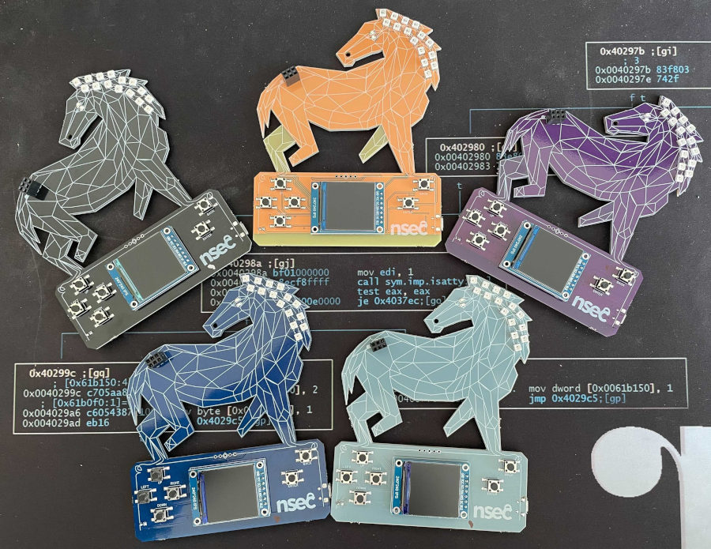
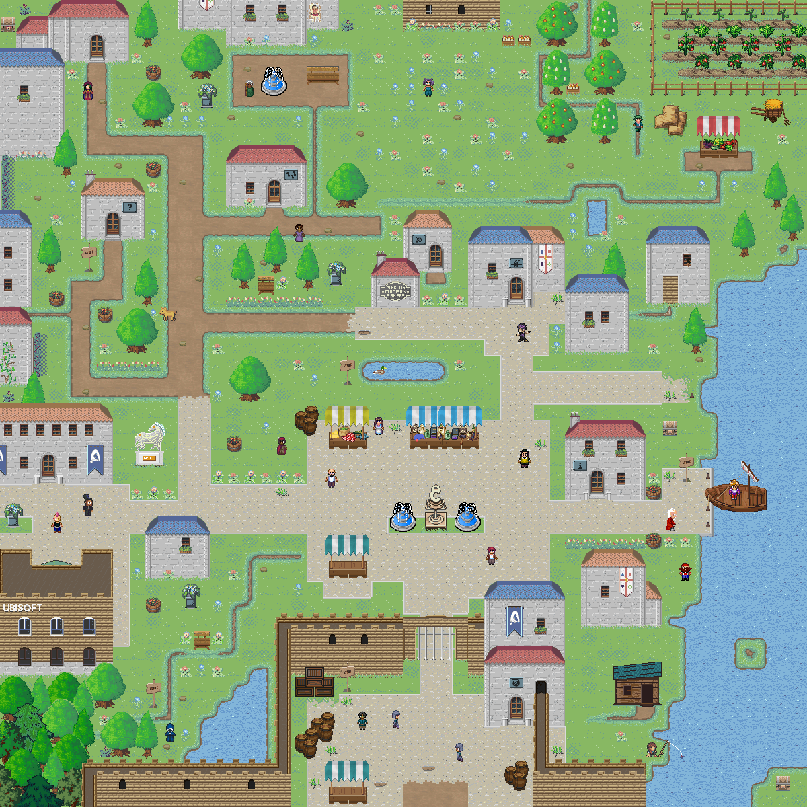

NorthSec 2021 badge
===================

Brought to you by the Team badge of NorthSec.

## Overview

<p align="center">
   <br>
  <i>Thou art most welcome to North Sectoria.</i>
</p>

The theme of this edition of the badge is loosely based on the main theme of
NorthSec 2021 CTF — the medieval kingdom of North Sectoria.  The interface it
styled as a simple JRPG with a small number of CTF flags hidden in the game
scene and various interfaces.

If you wish to modify the scene layout, use an SVG editor to modify the
[scene file](esp32/graphics/rpg.main.scene.svg) and rebuild the firmware.  The
original scene was developed using Inkscape, so any other SVG editors are not
officially supported.  The coordinate origin must be set to top-left corner of
the canvas, so older Inkscape versions may or may not work (not tested.)

## Hardware

The NorthSec 2021 badge is based on [ESP32 microcontroller](https://www.espressif.com/en/products/socs/esp32)
which is used to drive several periphery devices:

 - 240px by 240px LCD display
 - WiFi interface
 - [NeoPixel](https://en.wikipedia.org/wiki/Adafruit_Industries#NeoPixel) RGB LEDs
 - six buttons
 - a buzzer

The badge is powered through a micro-USB port or through an external battery
that can supply between 3.7V and 6V.

If you wish to hack your badge or create a new one based on the hardware. All
the information [is available here](hw/2021/).

## Building the firmware

The badge firmware is based on
[ESP-IDF](https://www.espressif.com/en/products/sdks/esp-idf) v4.3-dev
framework.  The exact commit is tracked as a submodule in `esp-idf`, and you
can install it with these commands:

```bash
git clone https://github.com/nsec/nsec-badge.git
cd nsec-badge/
git submodule update --init
./esp-idf/install.sh

# You need to manually install the Pillow package.
pip install Pillow
```

The installation procedure for your OS may differ a little, please consult the
[documentation website](https://docs.espressif.com/projects/esp-idf/en/stable/esp32/get-started/index.html#installation-step-by-step)
if you have any difficulties.

Once the installation is complete you can build the firmware and flash it to
the badge:

```bash
source esp-idf/export.sh
cd esp32/
idf.py build flash monitor
```

If for some reason `idf.py` is not able to complete the operation, refer to the
[ESP-IDF documentation](https://docs.espressif.com/projects/esp-idf/en/stable/esp32/get-started/index.html#step-9-flash-onto-the-device).
